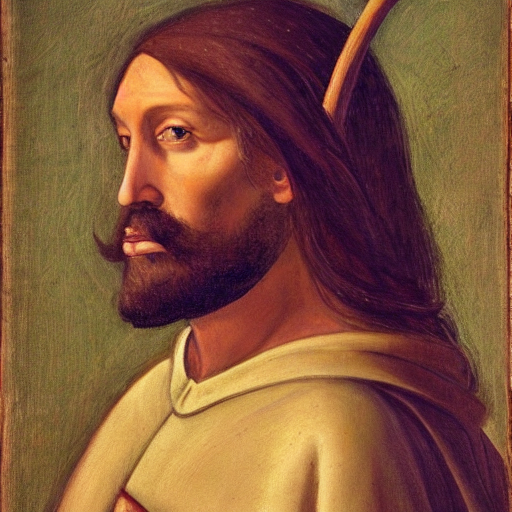
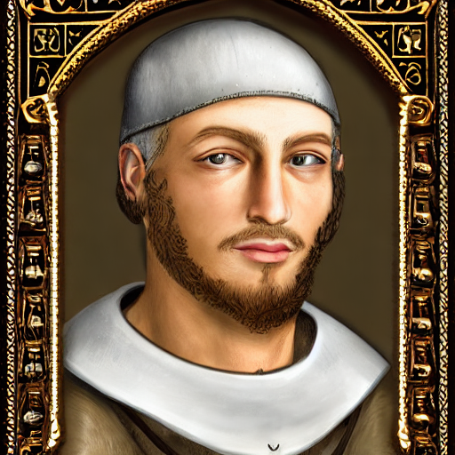
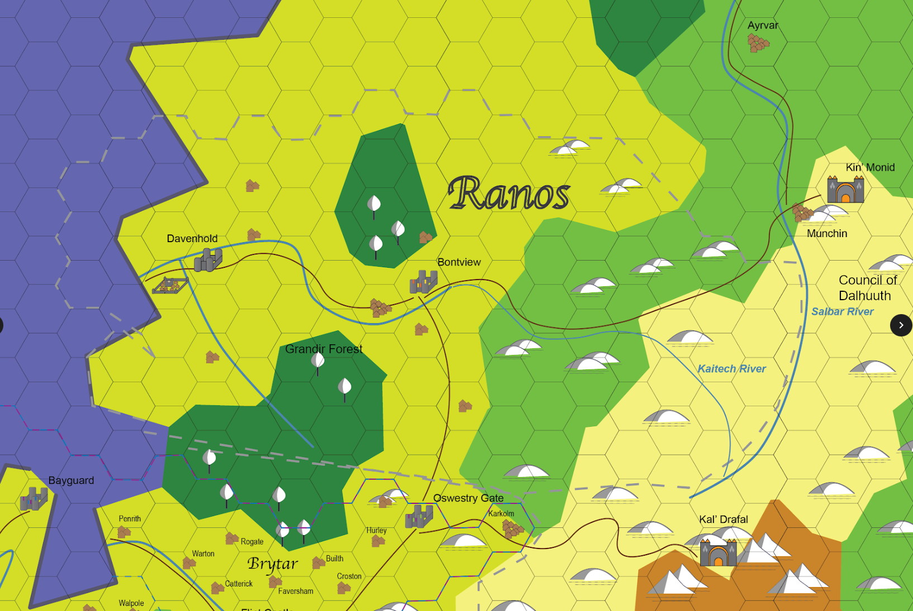
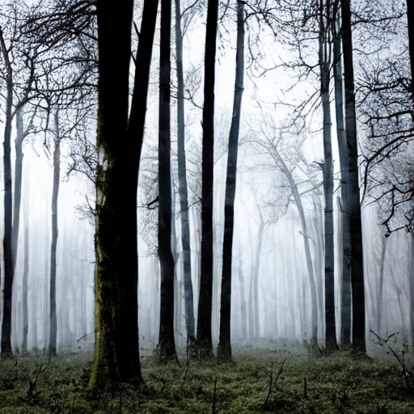
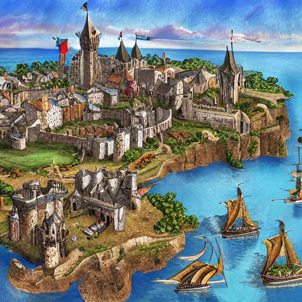
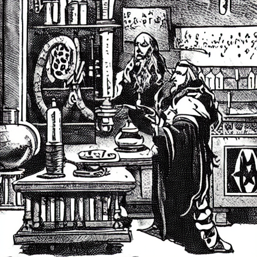
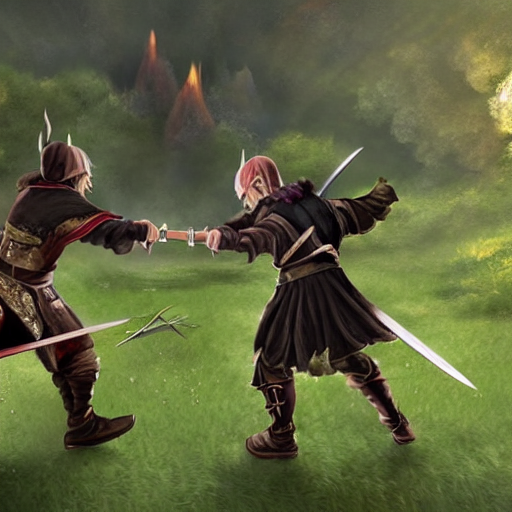
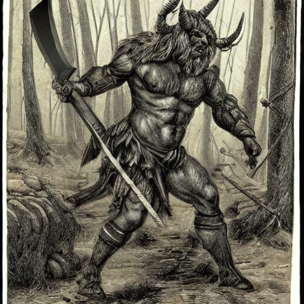

# Sometimes we are the bandits

In this adventure, you play as a member of the Guard of the Greenwood, a mercenary company in southern Ranos. The company has been tasked by the city state of Davenhold with building a siege engine for use in their ongoing war Bontview. The adventure begins in the with you and your squad being sent on assignment to collect tolls on the Kaitech River trade route, to accrue funds for the siege engine.

# The Guard of the Greenwood - Mercenaries of Opportunity

_Take only gold, leave only tracks_

From their cave hideout in the Grandir Forest, the Army of the Greenwood operates as a mercenary company that polices the roads and the wildlands of central Ranos. Formed during the Six Cities War, the company has spent the last fifteen years of relative peace in the region

## History

### Formation

The Guard was a the brainchild of former High Commander Denton Ashford and Chief Engineer Boval Reg. As members of nobel houses displaced by the Six Cities War, they sought to seek refuge in ruins scattered throughout Grandir Forest, a.k.a Greenwood. After establishing a settlement at the Greenwood Caves, and searching for ways to feed the influx of refuges and scattered regiments from the war, they opted to raid villages along the Kaitech to the north.

As their raiding grew more frequent to supply a ever growing influx of refugees to the Greenwood, they drew the ire of Count Valdan Mersman of Davenhold. In summer 2684, Count Mersman took a detachment of his army and laid a trap for the Greenwood raiders, ultimately surrounding them. Count Mersman realized that rather than executing the raiders as bandits, they had accrued resources and manpower that might be helpful in Davenhold's ongoing wars. An oath was sworn between Count Mersman, Denton Ashford, and Boval Reg to create the Guard of the Greenwood as an independent mercenary company allied with Davenport. The Guard was charged with defending the merchants on Kaitech and protecting from the surrounding wilds, ensuring a steady stream of trade between Davenhold and its new ally Bontview. In return, the Guard was authorized to collect taxes and tribute on the trade route.

### Role in the Six Cities War

Though the Guard spent most of the Six Cities War (which lasted from 2681 - 2694) adhering to their charter, they were occasionally employed by Davenport and Bontview to range outside of this region. The Guard became known for its exceptional scouts and recon units, whose skills were honed from ranging in the Greenwood. The Greenwood and the surrounding wilds provided a state of near constant alertness and training, turning the guard into a small but veteran fighting force.

### Since that time

The current year is 2709. Since the end of the Six Cities War, the Guard has continued to adhere to it's charter of ranging over the Greenwood and surrounding wilds, whilst collecting tolls and tribute on the Kaitech trade routes to fund it's efforts. Over this time, the size of the Guard has shrunk significantly - from it's height around 1,200 in the company during the Six Cities War to now around 150. The members that remain are an eclectic bunch, driven many different aims. Those that have joined in this time have done so for equally diverse reasons - life in the Guard is harder than in a city or town, as all must range and ranging contains constant dangers. Many see the Guard as a bastion of freedom away from the confined life of the cities - they trade the relative lack of rules for a more rugged outland living. Others join for the money, and those that survive for several years are likely to build a healthy savings. And still others join because the Guard is one of the few institutions left in Ranos dedicated to the exploration of the wilds and unlocking the mysteries that await there.

To most in the rest of the region, the guard are seen as somewhere between extortionists and outright bandits. The legality of their original charter has worn thin these past 15 years, and many merchants have began to lament the inconsistent stops along the Kaitech and the toll that must be paid. The motto of the Guard in current times is "_Take only gold, leave only tracks_" which they strictly adhere to - there will be no trouble if they are paid.

## Notable Officers of the Guard of the Greenwood

### Meramin Strongglide, Company High Commander

The third company commander, Meramin Strongglide is a halfling from the nations of Eastern Elaria. In her youth, she longed to travel to the lands she had heard of to the west, and to become a sword master fighting the in the epic continent-wide conflicts she had heard of. When she came of age, she traveled Western Elaria looking for teachers and mentors. As many did, she hurried to Ranos at the outset of the Six Cities War. She served in the auxillary of Bontview for some time, before joining the Guard as a captain in 2685. She quickly became the protege of Halmin Ruion, and was promoted to Commander when he accepted the role of High Commander after the death of Commander Ashford at the Battle of Cantara Harbor. When Commander Ruion left the Guard in 2701, he named Meramin as his sucessor.

Meramin has acquitted herself as a competent leader over her tenure with the Guard. She has kept the dwindling organization alive as it has diminished in size, and those that stay are generally happy with her light touch on rules. She still trains and still seeks to hone her skills in battle, ranging just as the other members of the guard, and leaving many administrative duties to the Chief Engineer, Boval Reg. She is recognizable at any distance for the fur clothing that she wears, even in the spring and summer warmth of Ranos (her homeland is much more tropical). She is keen, sharp, and is known to reward those that display dedication and talent. Few, if any, blame her for the decline of membership of the Guard. In fact, many see it as the opposite, and believe that under a lesser leader the Guard would no longer exist.

### Sylsandoral, Arch Magos

Sylsandoral is a high elf, likely older than the tomes referenced by the tomes in the mages tower of Bayguard. Enigmatic, recluse, and distant, he spends most of his days in intense study of the artifacts and relics uncovered by the Guard in Grandir Forest and beyond. From the inception of the Guard his motivations have been unclear. Sylsandoral was found by Reg and Ashford when they located the mythical Greenwood Caves - Sylsandoral was already living there. Though he never seemed to show interest in the Six Cities War or the events of the surrounding region, he used his magic to feed and shelter the refugees and early members of the company. When ranging efforts began to uncover more artifacts in the region, he began to provide council to the companies leaders on their nature and where more could be located. In time, he also seemed to take interest in mentoring young mages that joined with the company.

In recent years, the mage core of the company has faired even worse in numbers than the rest. Though scholars and mages sometimes come to the Greenwood Caves to consult Sylsandoral or view the companies collection of treasures, few stay. Still, Sylsandoral plods on, sometimes spending months in mediation to commune with and unlocks secrets of the relics brought before him. In recent years, sale of these relics has been a large source of income for the company, and Sylsandoral has played a large part in that business. Still, few understand the high elf's motivations, and many have resigned to the understanding that he will be there long after their grandchildren's grandchildren are dead and gone.

### Boval Reg, Chief Engineer

Though human at first glance, Boval is an Asamar. As all Asamar, his origin is unknown even to him. Boval awoke in Western Elaria in 2835, and took up residence in Pherasus in northern Ranos under the service of Balen Ashford, Denton Ashford's father. Denton came of age as Boval was learning his place in the world, and the two grew close. When Pherasus was sacked at the beginning of the Six Cities War and it's nobles scattered into exile, Boval accompanied Denton as he searched for a new home for the Pherasus refuges.

All asamar are uniquely gifted in some way, and Boval's gift has turned out to be unique even for an asamar. He is a profoundly talented engineer, able to derive detailed plans for structure and contraptions at the slightest description. This talent was useful to the Guard in it's early days, and may have even saved their existence. During his time in Pherasus, Boval gained enough of a reputation to be known as a talented builder. This did not go unnoticed by Count Mersman when he agreed to incorporate the raiders as mercenaries, as he had high hopes that Boval would be able to construct weapons which would help him win the Six Cities War.

For Boval, the existence of the company has taken on a meaning of its own. It is part memory of his lost brother Denton, and part his mark on the world. Boval is an optimist, and despite the claims of other that the company are bandits and thieves, Boval sees them still as providing a necessary service to the region. Over time he has come to appreciate the dangers of the wilds that the company protects against, and he sees it as his mission to build a place that attracts the kind of people who can fight that fight.

# The setting

## The region

Ranos is situated in North West Elaria. It is a rugged, jagged, and wild land. The region is arid, far more arid than it's southern neighbor of Valanar. Though hundred of years ago it was a kingdom under the rule of the great Nortund Empire, it has, for several centuries, been infamous as the land of a dozen kingdoms. At the fall of the Nortund Empire, great wealth, power, technology, and magic were left in the hands of the various cities of Ranos. These cities used this power to carve their own identities, leading to a Ranos that today is unified as a region in name only.

There are a few cultural tenants that pervade the region. Ranosians are not shy of magic - as the inheritors of Nortund, magic is accepted in most forms and recognized for it's power. They are technologically more sophisticated than many regions around them, and appreciate discovery of the physical as much as the metaphysical. Additionally, there is not a unified religion in Ranos (not as one might find to the south). This is not to say that they are not religious. Study of the divine goes hand in hand with study of the arcane in Ranos, and worshipers of most deities can find a community in one of the cities. Magic that would not be permitted most other places is far more accepted in Ranos. The most well known example of this is the Council of Dalhuuth, a mountain monastery for mages who study the unsavory arcane arts.

## Grandir Forest

The Grandir Forest, also known as Greenwood, is a vast forest that straddles Ranos and Valanar. Though villages and towns dot the outer edge of the forest, the inner forest is dense and impassible to most average folk. It runs the entire length from the Oswestry Crags in the east to the Bay of Arnlams in het west, creating a natural barrier between the two regions. The forest is known to contain many old ruins, both of the Nortund Empire and empires older than that. Enterprising explorers delve into the forest, seeking rare magical treasures in the form of artifacts, plants, and magical wildlife.

The Greenwood Caves, in the northern forest, are the hideout for the Guard of the Greenwood. From this place, the Guard ranges into the forest and the nearby lands, patrolling and keeping locals safe from the denizens of the forest.

## Davenhold

As one of the victors in the Six Cities War, Davenhold has been a city on the rise for the last 15 years. It is a city that is known for it's shrewd political elite, and ambitious gentry. Davenhold is an oligarchy, and a nepotic one at that. Governance of the cities most important functions are, and have been for some time, clustered in the hands of a few families. In recent years, under the leadership of the Mersman family, Davenhold has been consolidating power in the region. By marriage and treaties, they hold more direct and indirect influence than any city of Ranos has had for decades. Of the most recent months, they have been at ods with their old ally, Bontview, in a conflict that has boiled over to open hostilities.

## Bontview

Bontview has always made an odd pair with Davenhold as the cities that control the trade of the Kaitech River. Whereas Davenhold has spent many of the last 15 years learning to play a shrewd political game, Bontview has been focused on progress at all costs. Before the Six Cities War, Bontview was a center of learning and progress. From the many guilds to the university, many scholars, inventors, magi, priests, and artists flocked to Bontview to study. At the outset of the Six Cities War, it was unclear what allies Bontview intended to make, or if it intended to participate at all. It's alliance with Davenhold was somewhat unexpected, but it made it clear that Davenhold's armies would be supported by the many weapons and magics developed by the great minds of Bontview. Some attribute this to setting the war on an all but inevitable path, one in which the Kaitech cities were certain to come out ahead.

In the years since the war, Bontview has largely withdrawn from the politics of Ranos. Though still welcoming of great minds to the city, it is hard for anyone to mention Bontview without saying that the city is a bit odd. The city has begun to support many more funded expeditions into the wild-lands, including the Grandir Forest, in an apparent effort to acquire lost technologies and relics of the Nortund Empire. Most interactions with official diplomats of the city are spurred by the acquisition of relics from the safe houses of it's neighbors. To what end the city does this is mysterious, and unknown even to many of the people that live there.

## The Davenhold - Bontview conflict

In order to lock it's grip on southern Ranos, Davenhold needs to acquire Bontview (be it politically, militarily, or otherwise). Because Bontview has been politically withdrawn for the past several years, Davenhold felt that their alliance as frayed to a meaningless end. In 2705, Davenhold ended the alliance with Bontview. Bontview gave no response to Davenhold or anyone else. After a series of increasingly barbed rhetoric around Bontview to the other cities, Davenhold officially denounced Bontview's scouring of the Greenwood for relics and artifacts (as this is supposed to be neutral territory between them). Again, Bontview gave no reply. In fall 2708, Davenhold affirmed that they would defend the Greenwood in armed conflict, and began to assemble their army. As strange as a the lack of response from Bontview may seem, it is also clear that these are thinly veiled reasons given by Davenhold to fuel the cities own ambition for regional dominance. These are all details that a neutral observer from the region would understand, but your character may have different interpretations of these events based on where they are from, their previous or current allegiances, and their general intelligence.

The current state of the conflict that Davenhold has positioned it's army outside of Bontview, but the city is not under seige. Early attempts to surround Bontview caused Bontview to unveil a new weapon that it had been working on, which drove the army of Davenhold to retreat to a more neutral stance. The nature of this weapon is largely unknown, save those who must have seen it in action - however, so many rumors have been swirling around what it is that is impossible to tell fact from fiction. What is clear is that without proper seige equipment, Davenhold has little change of forcing Bontview to the negotiating table, as even with a vastly superior army they are in no position to starve or storm the city.

## The Brayherd

Brayherds are a danger not unknown to Ranos. North of Ranos in the forests of the norther wastes live many terrifying monsters, not least of which are the Beastmen. The product of a centuries old experiment gone wrong, the Beastmen clans sometimes form into large migratory tribes, which seek to murder and rampage over the land to appease their sadistic gods. When these tribes slip south past the Nar'Togtgh orcs, they are called Brayherds, a name given by the animalistic cries and calls that proceed their attacks on ill fated targets.

This is exactly what happened in 2706, as a combined effort by the orcs in the north drove a Brayherd from their lands. The Brayherd, while not large, has been living the central wilds of Ranos for the past three years, pillaging and slaughtering while outmaneuvering the sluggish armies of the various city states. They have made it to southern Ranos, and are thus operating nearby. The hope of many local towns and villages is that after the Davenhold - Bontview conflict is resolved that Davenhold will turn its army to dealing with the Brayherd.
